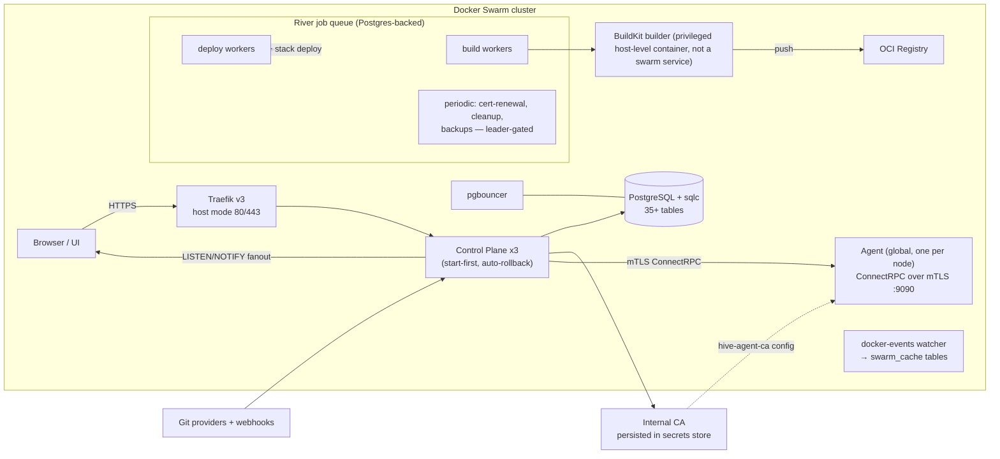

# Architecture Overview

Hive is a self-hosted deployment platform on **Docker Swarm**. A replicated
**control plane** owns state and orchestration; a per-node **agent** executes
node-local operations over mTLS.

## Components

Key facts:

- **Job execution is River-only.** Builds, deploys, backups, certificate
  renewals, and cleanups all run as River jobs stored in Postgres (`river_job`
  table) with per-queue concurrency (`build` max 2, `deploy` max 5, others 1)
  and retry budgets (builds 3 attempts, deploys 4). There is no legacy polling
  worker. Periodic schedules are registered at boot but only started by the
  elected leader.
- **State is PostgreSQL + sqlc** — typed queries, forward-only numbered
  migrations applied at boot, plus River's own schema migrated at startup.
- **Realtime is LISTEN/NOTIFY.** A dedicated connection with automatic
  reconnect fans out on channels `system`, `deployment:{appID}`, and
  `service:{serviceID}`; the API bridges these to the browser over WebSocket
  (`/api/v1/ws/events`).
- **Swarm observation** — a docker-events watcher keeps `swarm_cache`
  tables (services/tasks/nodes) current and emits NOTIFY so replicas refresh
  without hammering the Docker API.
- **Security** — internal CA persisted in the encrypted secrets store and
  published to agents as the `hive-agent-ca` Swarm config; agent mTLS enabled
  by default in `deploy/hive-stack.yml` (TLS 1.3, 72h certificates,
  auto-renewal). Secrets are AES-256-GCM encrypted at rest under an HKDF-derived
  master key from `/run/secrets/hive-master-key`. See [security.md](../security.md).
- **Ingress** — Traefik v3 runs host-mode 80/443 on managers with the Swarm
  provider, shared ACME volume, and sticky cookie `hive_sticky` for
  control-plane replicas.
- **Self-update** — see flow below.

## Data Flows

### Deploy & Build

1. User triggers deploy (UI/API) or a webhook fires → control plane validates
   and inserts a `build_jobs` row plus a River `BuildJobArgs` job.
2. A `build` worker clones the repo (git binary inside the control-plane image), runs a **BuildKit** build via the TCP endpoint `BUILDKIT_ADDR` (default `tcp://buildkit:1234`). BuildKit itself runs as a **privileged host-level container** on each builder node — swarm services cannot obtain `CAP_SYS_ADMIN`, which buildkitd's snapshotter requires.
   strategy), streams logs to the DB, and pushes the image to the bundled OCI
   registry (or the application's pinned external registry, authenticated via
   decrypted credentials from the secrets store).
3. On success a River `DeployJobArgs` job renders the full service spec
   (compose-go for stacks) and applies it through the Swarm API. Applications
   get a project overlay network `hive_project_{slug}`, plus `hive_proxy`
   attachment when domains exist; domain routers/TLS labels are applied.
4. Preview deployments use the same pipeline against PR refs, with cleanup
   jobs on merge/close.
5. Progress flows back to the UI via deployment-scoped NOTIFY → `/ws/events`.

### Terminal

Browser ⇄ WebSocket `/api/v1/ws/terminal/{containerID}` ⇄ control plane ⇄
ConnectRPC over mTLS to the node agent running on the container's host ⇄
Docker exec. Resize and stdin/stdout are proxied bidirectionally; the control
plane never runs exec itself.

### Logs

Build logs are persisted by the build worker and served from the DB
(`GET /api/v1/builds/{id}/logs`). Live container logs stream through
`/api/v1/ws/logs/{containerID}` along the same CP→agent mTLS path as terminal.

### Events

The docker-events watcher writes observed services/tasks/nodes into the
`swarm_cache` tables and emits NOTIFY on `system`; handlers read cached rows
for fast list endpoints. Any replica can serve reads because state lives in
Postgres, not in-memory caches.

### Self-Update

The updater polls GitHub releases for the latest tag, compares it with the
running image tags, exposes status at `GET /api/v1/system/update`, and triggers
updates at `POST /api/v1/system/update`. An update performs a Swarm rolling
update of the `control-plane` and `agent` services to the new tag; the stack's
`start-first` + rollback configuration means failed health checks roll back to
the previous revision automatically. The same engine backs `hivectl update`.
Migrations run forward-only at boot — downgrades are **not supported**
([upgrade.md](../operations/upgrade.md)).

## Further Reading

- [Deployment quickstart](../deployment/quickstart.md) ·
  [Production guide](../deployment/production.md)
- [Operations runbook](../operations/runbook.md)
- [API reference](../api.md)
- [ADRs](../adr/README.md) — decision history (Swarm-first, Postgres primary,
  tiered HA, required registry, Go agent, BuildKit pipeline, OpenAPI contract,
  realtime strategy)
