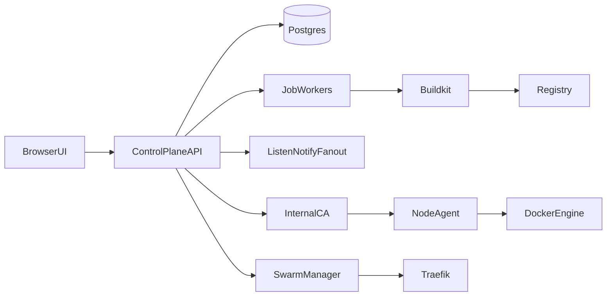

# Architecture Overview

```mermaid
flowchart LR
  browser[BrowserUI] --> api[ControlPlaneAPI]
  api --> postgres[(Postgres)]
  api --> swarm[SwarmManager]
  api --> fanout[ListenNotifyFanout]
  api --> jobs[JobWorkers]
  jobs --> buildkit[Buildkit]
  buildkit --> registry[Registry]
  api --> ca[InternalCA]
  ca --> agent[NodeAgent]
  agent --> docker[DockerEngine]
  swarm --> traefik[Traefik]
```
